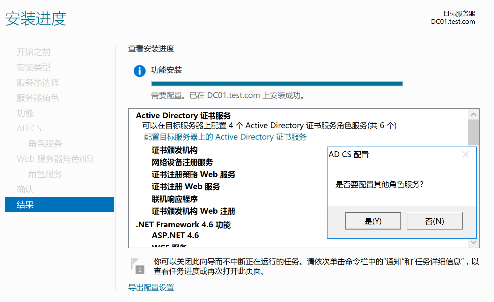
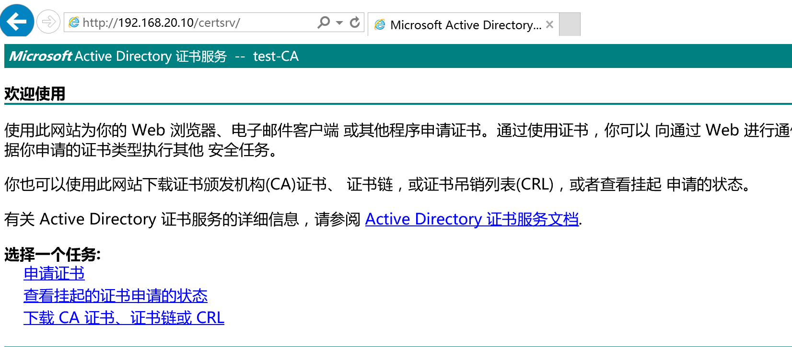
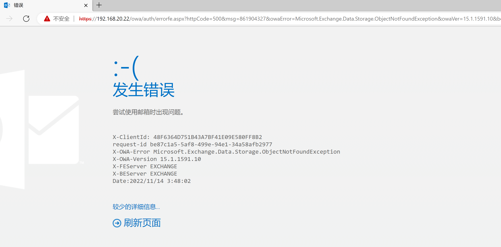

# 之前的问题

- 08 作为主域控，操作不是很舒服，略卡顿
- 避免一个虚拟机重复拷贝，可能会出现加用户时，提示 SID 冲突
- 账号密码未设置为永不失效，需要频繁修改密码
- 只有一个域用户，所有机器均是它加进域的，测试委派时易混乱
- AD CS 部署问题
- 网段划分
- 同网段内，域外机器，方便测试，包括 Kali 等机器
- VM 仅主机模式，不出网问题

# 规划图


# 双网卡

双网卡机器上，server16、server12 在访问 test.com 会走域内的 dns，win7 就直接访问了公网，更改 DNS 设置也不行

暂时考虑日常将 NAT 网卡禁用，需要联网下载时，再启用

# ADCS


先配置证书颁发机构，需要依赖前两个服务


结束后再配置其他角色服务




需要指定一个域用户，并且在本地的 IIS_IUSRS 组当中 ，如果 ADCS 安装在域控上，那么这个用户也需要能够登录域控（可以选择将其加入管理员组，当然是有风险的）


将用户添加到域管组当中


指定时需要输入密码


后面也有同样的需求，操作一致


之后就完成了整个的安装

访问 `http://192.168.20.10/certsrv/` 

需要使用域用户来认证




然后申请证书-》高级证书


这里需要提交 Base64 的证书提交


在 IIS 中进入服务器证书，选择创建


通用名称就是需要申请的域名


之后会生成一个 Base64 的证书文件


将值贴入，并选择证书模板为 Web 服务器


之后下载证书，会得到一个 cer 的证书文件


接着在  IIS 中选择完成创建


选择并指定存储


接下来验证一下，是否生效

手动增加一条 A 记录


直接访问 https 会出现证书错误


然后编辑网站并修改 SSL 证书


之后再重新访问，证书已经正常工作


- 注意主备域控之间的数据同步是需要时间的，DNS 记录的同步默认需要 15 分钟，在同步之后还需要通过 `ipconfig /flushdns` 来刷新一下本地的 DNS 缓存才能够生效

# Exchange

在 Server16 上安装 ExchangeServer2016-x64-cu11

需要先安装一个补丁包 kb3206632

但是如果直接装载会报错


可以在本地解压完成后，再拷入执行 Setup


之后等待一会，时间可能会较长，之后就会出现安装界面


之后就是复制文件，初始化等操作了，静待安装


为了简便，选择不拆分


在检查完先决条件后，就可以安装了


之后就发现需要有多个环境包需要安装


在解决完依赖之后，就可以继续安装了


漫长等待之后就完成了


之后在 PC 机器上验证，此时只能登录管理员，其他域用户当前是不存在邮箱账号的


如果登录的时候，出现了 "Microsoft.Exchange.Data.Storage.ObjectNotFoundException" 的错误



此时事件查看器中的错误是 146


可以去 Exchange 的 Management Shell 当中执行下面的命令，先禁用用户，之后再启用

```
Disable-Mailbox -identity administrator
Enable-Mailbox -identity administrator
```


然后再刷新就可以了


如果访问报了 503 等错误，可以在 Exchange 的 IIS 管理当中，检查默认网站的证书绑定情况


还有 Exchange 444、81 等端口的证书绑定情况和开放情况等


完后重启即可


