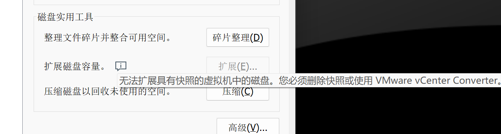

在搭建环境的时候经常会出现一段时间之后，空间不够的问题，但是扩容又发现无法进行，主要问题就只有一个，VM 的扩容不允许之前存在快照



所以需要先移除当前快照，或者将当前快照状态完整克隆一份新的出来，然后再进行增加

之后的操作就很容易了，用自带的也可以，用第三方工具也可以

Windows 可以使用 DiskGenius

Linux 可以使用 gparted

```
sudo apt-get install gparted
```

都是图形化操作，纯点击就可以了