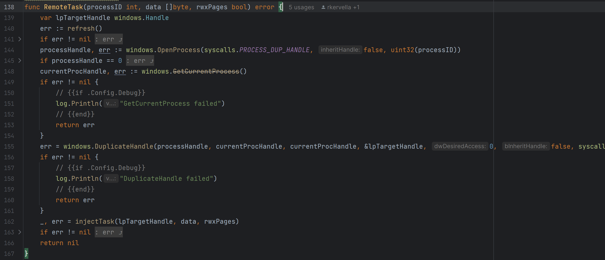
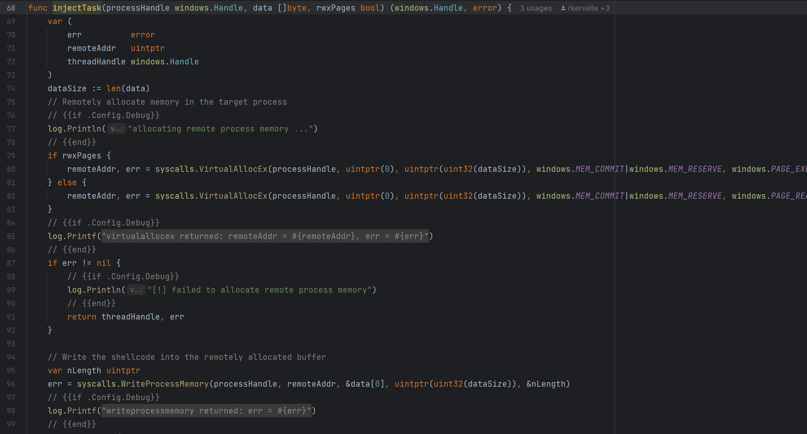
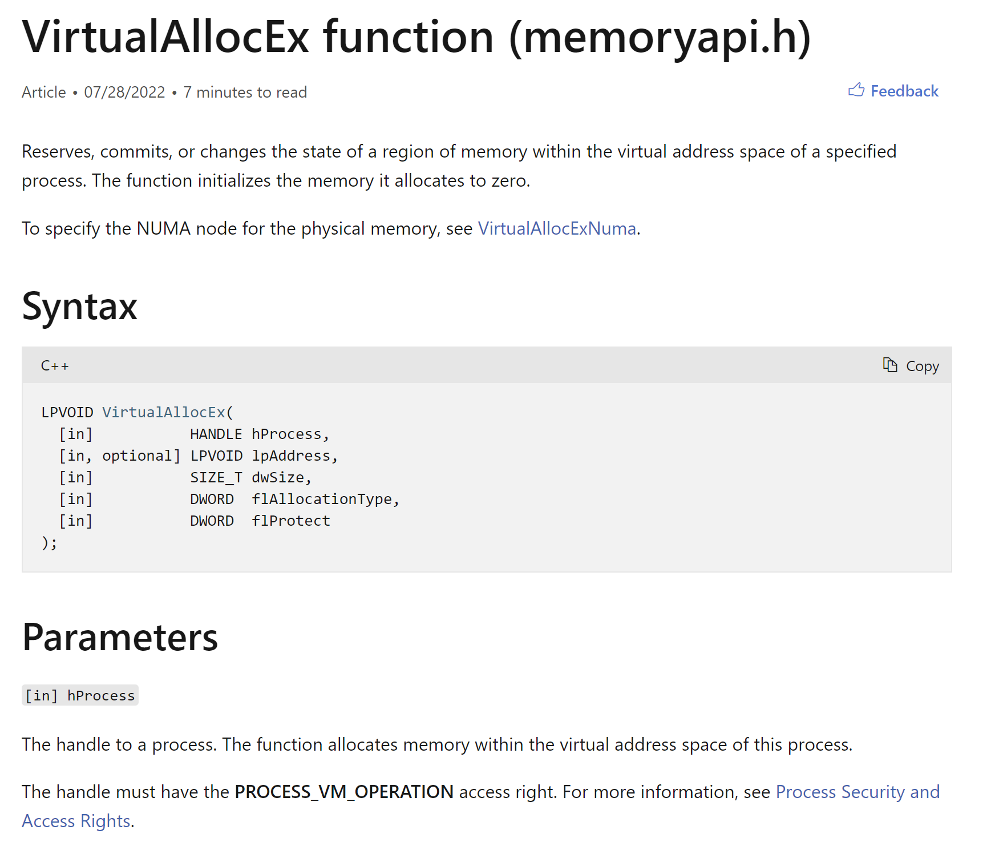
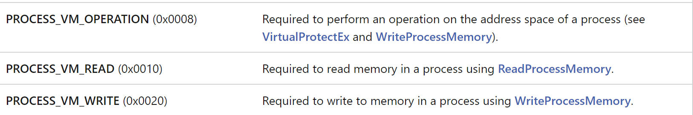
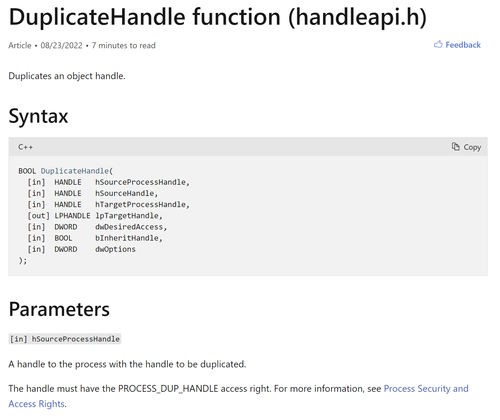
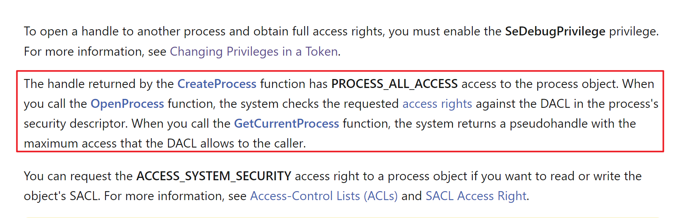
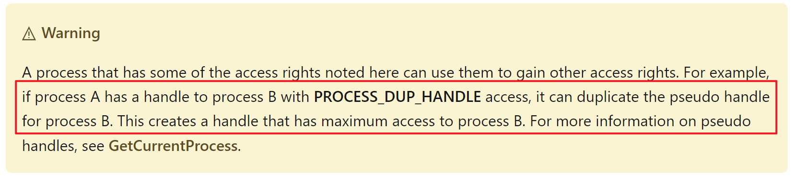

进程注入都是正常的注入流程，但是在 Sliver 中有些许的不同，拿 CreateRemoteThread 来说

拿 ired 中的例子来说明

https://www.ired.team/offensive-security/code-injection-process-injection/process-injection#executing-shellcode-in-remote-process

```
processHandle = OpenProcess(PROCESS_ALL_ACCESS, FALSE, DWORD(atoi(argv[1])));
remoteBuffer = VirtualAllocEx(processHandle, NULL, sizeof shellcode, (MEM_RESERVE | MEM_COMMIT), PAGE_EXECUTE_READWRITE);
WriteProcessMemory(processHandle, remoteBuffer, shellcode, sizeof shellcode, NULL);
remoteThread = CreateRemoteThread(processHandle, NULL, 0, (LPTHREAD_START_ROUTINE)remoteBuffer, NULL, 0, NULL);
CloseHandle(processHandle);
```

可以看到在获取句柄的时候，使用过 OpenProcess 获取 PROCESS_ALL_ACCESS 权限

但是在 Sliver 当中的流程是这样的

先 OpenProcess 获取 PROCESS_DUP_HANDLE；然后 DuplicateHandle 复制句柄，最后使用复制到的句柄进行注入



注入就是一样的流程了



那这两种操作有什么区别呢，翻看微软文档可以发现一些差异

当我们要去申请内存的时候，是需要有 PROCESS_VM_OPERATION 权限的



再去看看权限列表，发现如果要完成后续的注入并不止这一些权限



所以说要进行后续的操作需要有一系列的权限支持，所以我们一直使用的是 PROCESS_ALL_ACCESS

而 DuplicateHandle 很明显，要完成这个步骤只需要有一个权限 PROCESS_DUP_HANDLE 



那直接 OpenProcess 和 DuplicateHandle 有什么区别了，微软文档当中也有描述，可以看出它们在进行权限校验的时候是走了不同的验证逻辑



再后面微软也有更加明确的描述，复制句柄之后能够获取到访问目标进程的最大权限



从这块也就间接看出来，OpenProcess 获取 PROCESS_ALL_ACCESS 拿到的句柄权限 跟 DuplicateHandle 得到的句柄权限还是存在一定的大小差别