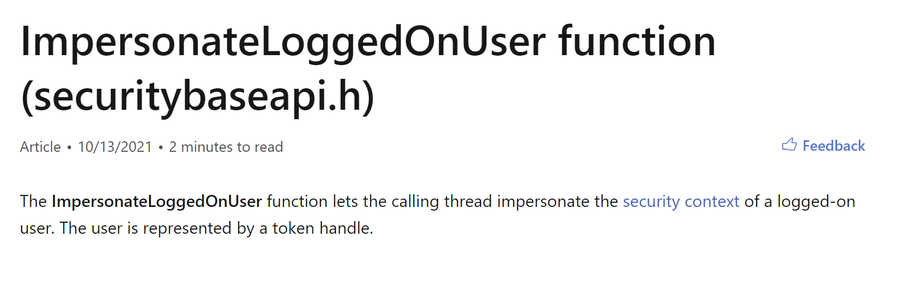
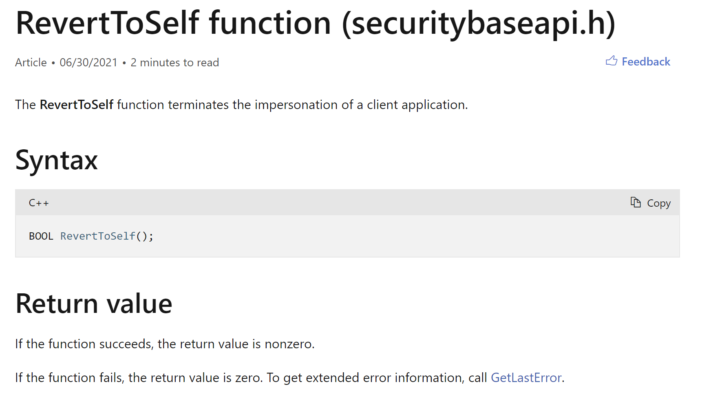
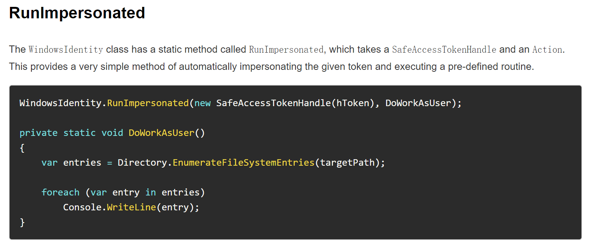
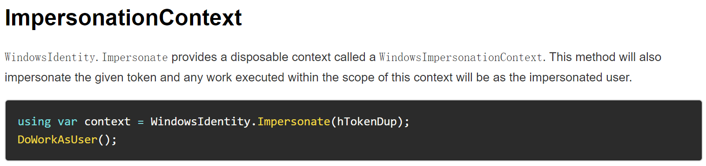
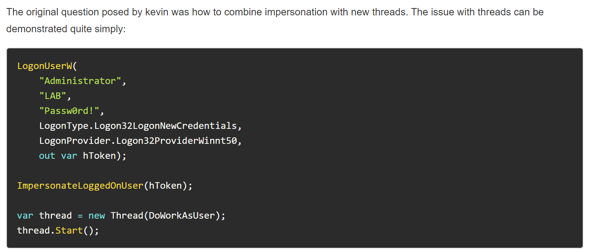
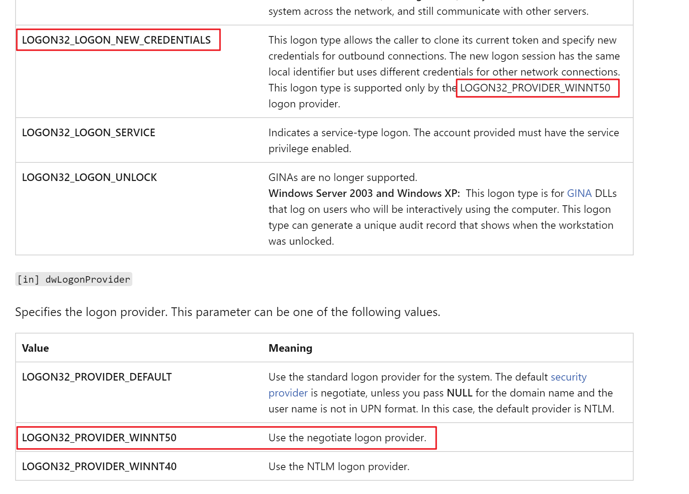

# StealToken

StealToken 的流程是比较清楚简单的，但是要将其整合进框架等其他情况的话，还需要再多考虑一些其他的问题

基本流程就是这样

```
RtlAdjustPrivilege
OpenProcess(PROCESS_QUERY_INFORMATION, TRUE, dwPid)
OpenProcessToken(hProcess, TOKEN_DUPLICATE | TOKEN_ASSIGN_PRIMARY | TOKEN_QUERY, &hToken)
ImpersonateLoggedOnUser(hToken)
DuplicateTokenEx(hToken, MAXIMUM_ALLOWED, NULL, SecurityDelegation, TokenPrimary, &hNewToken)
ImpersonateLoggedOnUser(hNewToken)
```

在正常工具当中，到这里也就结束了，直接使用新的 Token 创建一个进程就 OK 了，当要整合的时候，就会发现，它还有一些需要考虑的地方，如何在不创建 cmd 的时候，继续使用 Token 去执行其他的命令

首先根据文档可以得知，当前模拟的 Token 是基于线程上下文的



所以后续的执行流程都必须依赖于经过模拟的线程

当在 C2 中执行时，steal_token 执行完成后，当前的功能点也就结束了，然后继续执行 pth、dir \\\\xxxxx\\c$ 等命令时，所依赖的点已经不再是当前的线程了，为了保证后续所使用的功能都继续使用当前模拟的 Token 来进行

可以在 steal_token 执行完之后，将新 Token 的 Handle 保存下来，当在其他地方执行之前，先判断有无已经克隆的 Token，如果有的话就再使用这个 Handle 模拟一次，保证后续的流程

```
if TokenHandle != 0 {
	ImpersonateLoggedOnUser(TokenHandle)
} else {
	RevertToSelf()
}
```

之后在 rev2self 的时候，也就需要注意将之前保存的句柄清除掉，以免后续继续使用一个不存在的句柄在继续模拟，导致问题的发生

rev2self 所使用的就是微软提供的停止模拟的 API

```
BOOL RevertToSelf();
```




# C#中的模拟

昨天看到了 rastamouse 关于 Token impersonation 的文章

https://rastamouse.me/token-impersonation-in-csharp/

主要提了 C# 的两种模拟的方案



这个很明确，通过一个指定的 Token 来执行所提供的函数

另外一个有点不一样，是通过修改上下文来进行执行的



这次对这块进行补充主要的原因是，在上面通过 Win32API 进行的模拟，只对于当前线程有作用

而在这篇文章中则提到了 C# 当中跨线程的模拟



# make_token

顺带一提，rastamouse 文章中也描述的 make_token ，make_token 使用的是 LogonUserW 来实现的，用来制作 Token 主要是依赖于其中的两个参数



它会保证当前线程继续使用原有的 Token，只有在进行网络请求访问的时候才会使用新的模拟的 Token