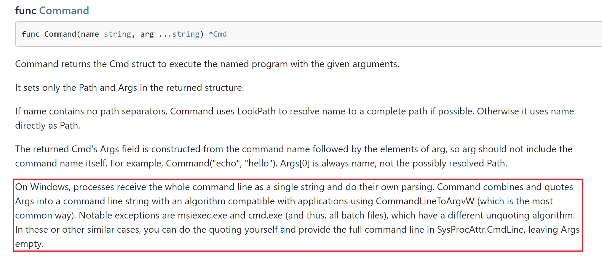
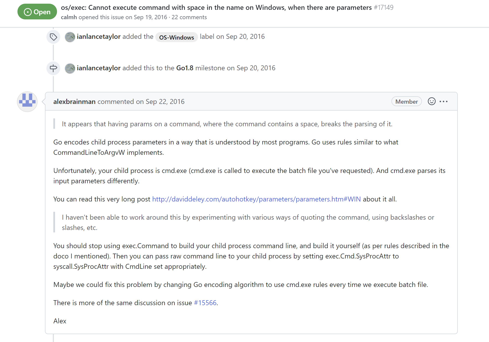
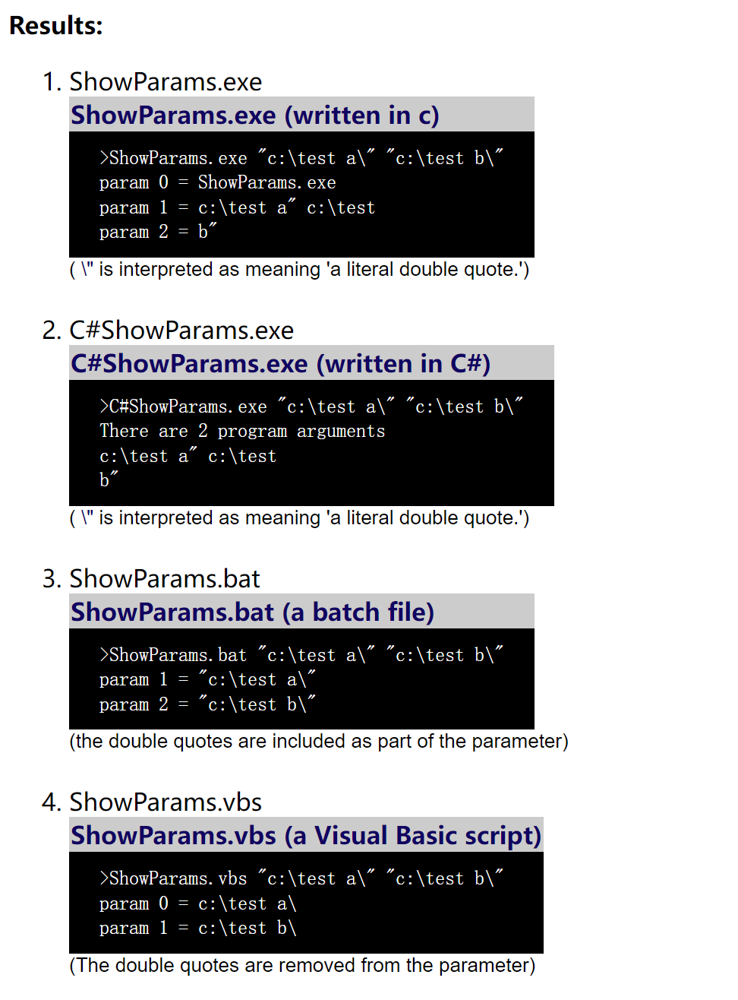

当使用 exec.Command 来进行传参执行的时候，会出现参数没有被正确识别的情况，在跟引号和路径等相关情况的时候最为突出

在搜索资料的时候，发现了一篇有类似情况的文章 https://oser.space/post/gocmd/

作者提到了官方文档中的一段话，这块之前确实没有注意到

https://pkg.go.dev/os/exec#Command

大致是由于不同地方对于参数处理的不一致，导致了不同的执行结果

在 Go 的 Issues 当中也有类似的反馈

https://github.com/golang/go/issues/17149

其中所指向的另一篇文章对这一块的例子说的很明确了，不同程序下所对应的不同解析

https://daviddeley.com/autohotkey/parameters/parameters.htm#WIN

官方文档中给出的建议是，将参数放在 `SysProcAttr.CmdLine` 当中，并将 `Args ` 处制空

> In these or other similar cases, you can do the quoting yourself and provide the full command line in SysProcAttr.CmdLine, leaving Args empty.

这样就可以正常进行解析了