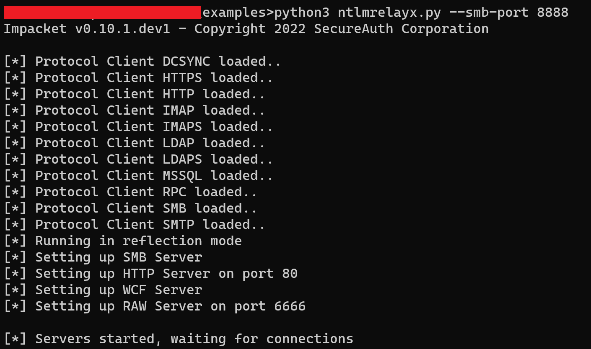
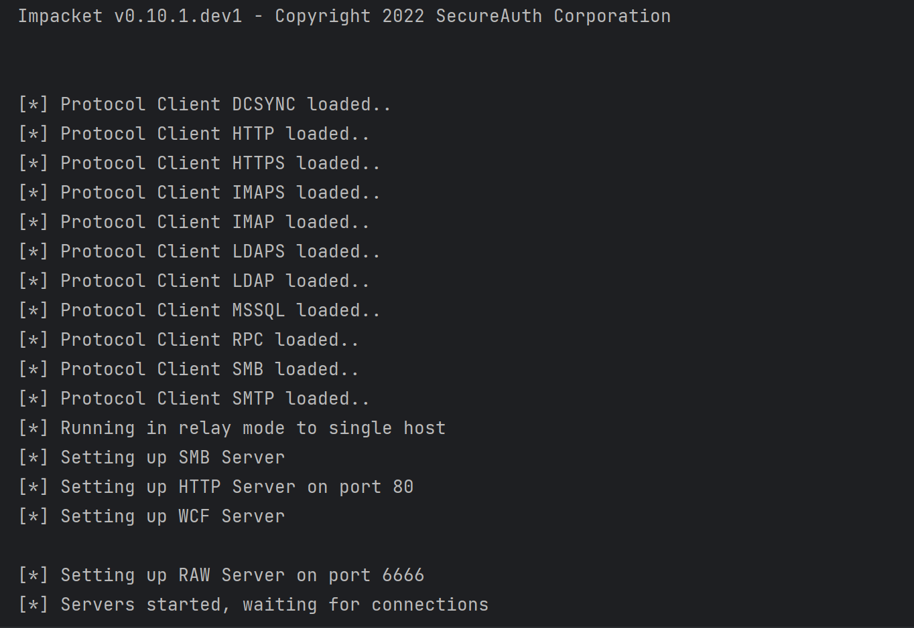
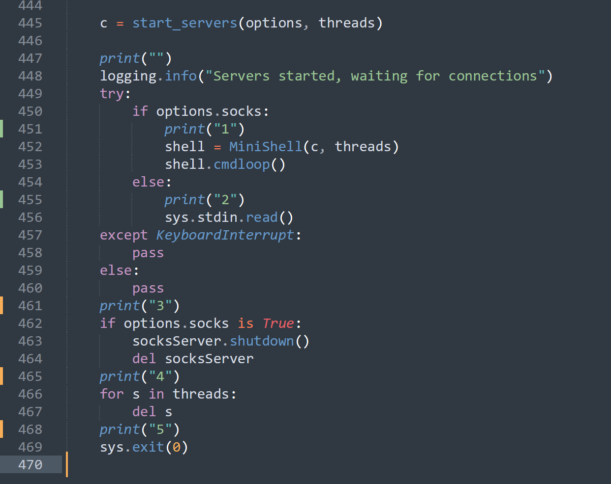
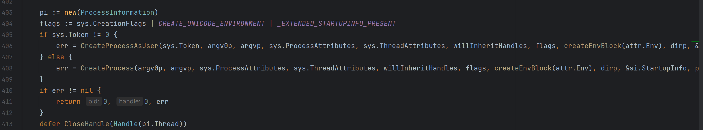

在正常执行 exec.Command 的时候是这样调用的

```go
cmd = exec.Command(path, args[1:]...)
cmd.SysProcAttr = &syscall.SysProcAttr{HideWindow: true}
if err = cmdhandle.Start(); err != nil {
	return err.Error()
}
if err = cmdhandle.Wait(); err != nil {
    return err.Error()
}
```

正常执行等是没有问题的，但是在执行 ntlmrelayx 的时候缺出现了 Python 进程直接退出的情况，但是在命令行下执行是没有问题的



而在 Golang 中用 exec.Command 的 Start() 就会直接结束，虽然执行到了同一个地方，但是进程直接没有了



于是想确定一下所执行到的位置，来判断一下可能出问题的地方

增加了五次结果输出



然后命令行与 Golang 执行的结果如下

命令行

```
Impacket v0.10.1.dev1 - Copyright 2022 SecureAuth Corporation

[*] Protocol Client DCSYNC loaded..
[*] Protocol Client HTTPS loaded..
[*] Protocol Client HTTP loaded..
[*] Protocol Client IMAP loaded..
[*] Protocol Client IMAPS loaded..
[*] Protocol Client LDAP loaded..
[*] Protocol Client LDAPS loaded..
[*] Protocol Client MSSQL loaded..
[*] Protocol Client RPC loaded..
[*] Protocol Client SMB loaded..
[*] Protocol Client SMTP loaded..
[*] Running in reflection mode
[*] Setting up SMB Server
[*] Setting up HTTP Server on port 80
[*] Setting up WCF Server
[*] Setting up RAW Server on port 6666

[*] Servers started, waiting for connections
2
```

Golang

```
Impacket v0.10.1.dev1 - Copyright 2022 SecureAuth Corporation


[*] Protocol Client DCSYNC loaded..
[*] Protocol Client HTTP loaded..
[*] Protocol Client HTTPS loaded..
[*] Protocol Client IMAPS loaded..
[*] Protocol Client IMAP loaded..
[*] Protocol Client LDAPS loaded..
[*] Protocol Client LDAP loaded..
[*] Protocol Client MSSQL loaded..
[*] Protocol Client RPC loaded..
[*] Protocol Client SMB loaded..
[*] Protocol Client SMTP loaded..
[*] Running in relay mode to single host
[*] Setting up SMB Server
[*] Setting up HTTP Server on port 80
[*] Setting up WCF Server

[*] Setting up RAW Server on port 6666
[*] Servers started, waiting for connections
2
3
4
5
--- PASS: TestExecCmd (0.63s)
PASS


Process finished with the exit code 0

```

对照上面的内容，也就是说明问题是出在 `sys.stdin.read()` 函数上

从字面意思可以明白，这里是在读取标准输入信息的，可是这里并为什么会决定 Golang 的执行流程呢，我们也没有做多余的处理

为了确定这里到底做了什么事情，跟进 Start() 看了一下实际的实现

一步步跟进去以后，发现并没有做什么特殊的操作，最后都是直接调用了 CreateProcess 来进行进程创建



所以问题并不应该出在进程创建，而是应该在一些流程或者参数的处理上

翻阅了很多资料，一直没有发现可能出现问题的地方，一度怀疑是交互的问题，又寻找了很多 Golang 实现交互式 Shell 的代码，并没有找到预期的东西

但是发现了一个共性的地方，它们的代码都有去专门处理 `stdin` ，难道是这个问题？？？

于是自己测试了一下，增加了对于这块的处理，将系统的标准输入给到当前

```
cmd.Stdin = os.Stdin
```

之后再进行测试已经完全没有问题了，进程也不会因此而退出


于是盲猜，可能是如果我们没有专门去指定输入、输出的话，它会直接不接收或者直接进行自己专门的处理

后面跟了一下 Golang 的相关处理，也对照微软文档寻找了相关的参数描述，但是并没有发现其中会出现问题的地方，这块有机会再继续跟进吧