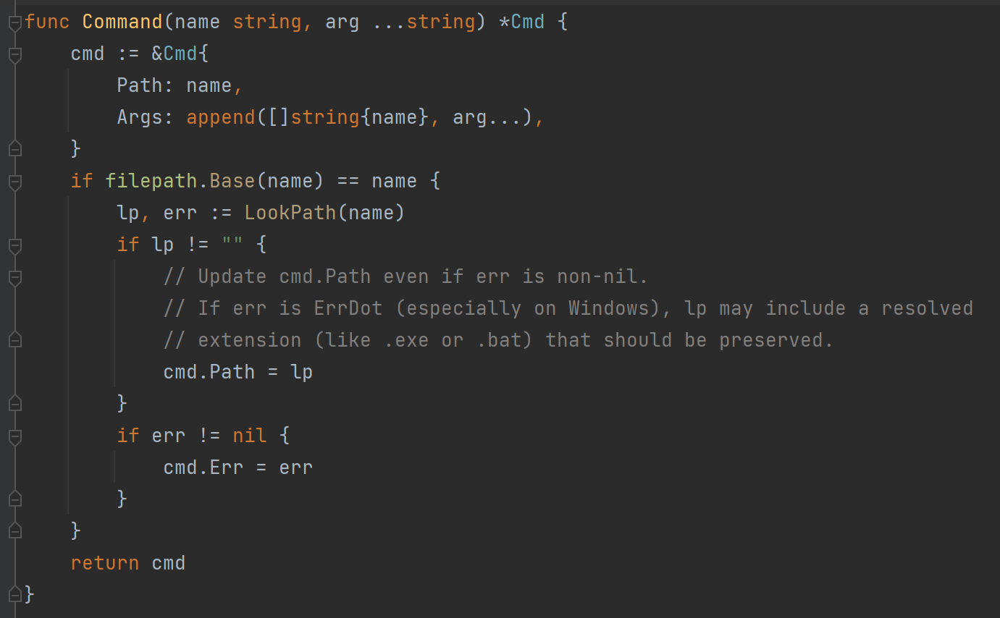
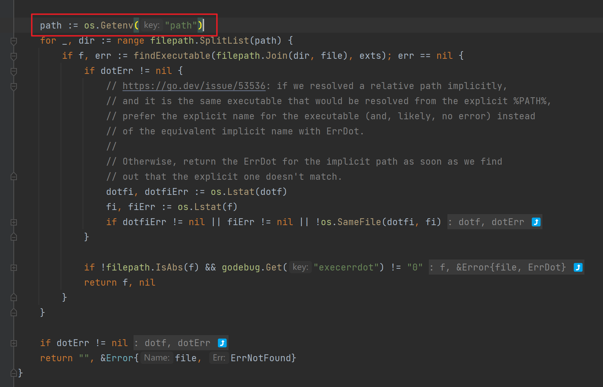
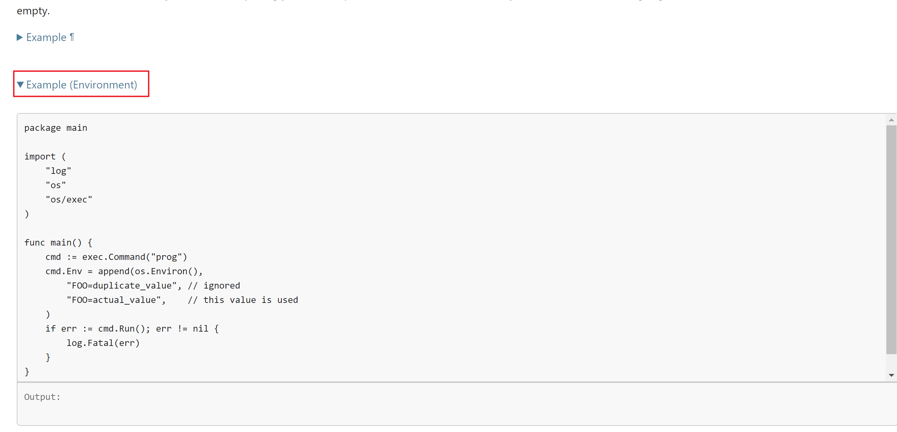
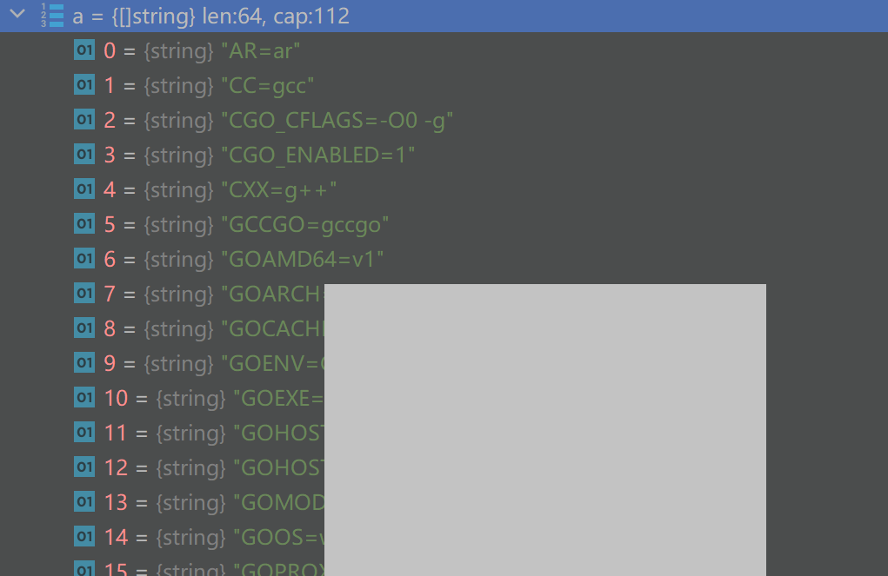

# 问题

使用 `exec.Command(name, args)` 来执行命令，在执行 `sc query w32time` 时，报错 `executable file not found in %PATH%` 

# 尝试

根据 Command 的代码实现，如果第一个参数只填写名字的话，他会通过 LookPath 来寻找文件路径之后再执行



LookPath 当中也获取了 path 环境变量，然后从中寻找



理论上来说是没有问题的，但是实际上还是会出现无法找到的情况

就报错和翻阅的资料来说，确实是环境变量的问题

# 解决

从官方文档中的示例可以看到它有专门设置环境变量的例子

https://pkg.go.dev/os/exec#Command



其中调用了 `os.Environ()` 来获取基本的环境变量，可以看到非常全的环境变量



之后再执行命令就不会出现问题了

```
cmd := exec.Command("prog")
cmd.Env = append(cmd.Env, os.Environ())
```

