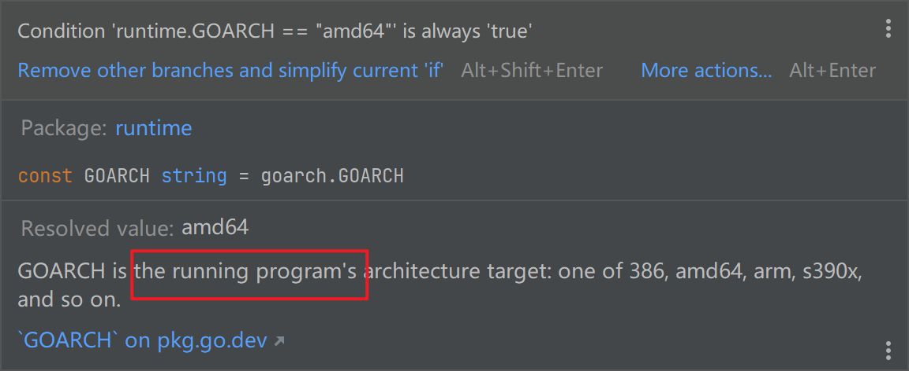
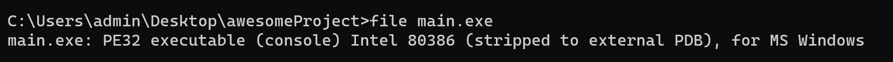
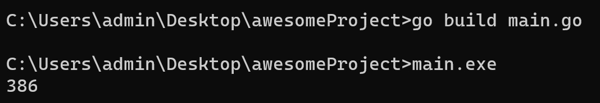
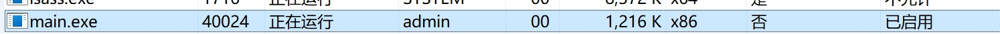
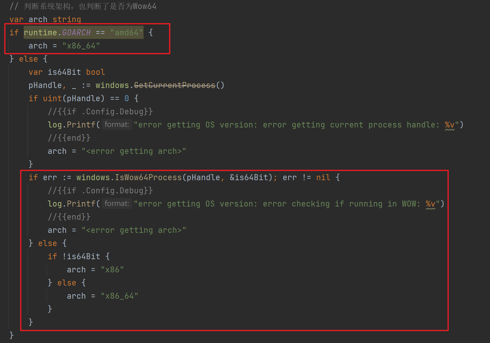

`runtime.GOARCH` 获得的到底是代表运行进程还是操作系统的架构

在网上有很多地方都在说当前是代表了当前系统的架构


但实际上并不是这样，官方给的注释是这样的



可以通过一个程序验证一下

```
package main

import (
	"runtime"
	"time"
)

func main() {
	println(runtime.GOARCH)
	time.Sleep(20 * time.Second)
}
```

然后设置环境变量，编译一个 32 位的程序出来

```
set GOARCH=386
go build main.go
```



然后运行



此时在 Windows 进程列表中的展示是



也就更加准确的说明了 `runtime.GOARCH` 代表的实际上是当前进程的架构，与操作系统无关

如何判断当前操作系统的架构情况，这里借鉴最近在看的 Sliver 中的代码来说明

先判断 amd64 这个没有争议

然后判断当前进程是否是 Wow64，然后再最终决定当前是 32 位还是 64 位




Sliver 相关的笔记可以参考 https://github.com/l4stchance/sliver/blob/Review/Sliver-Review.md
