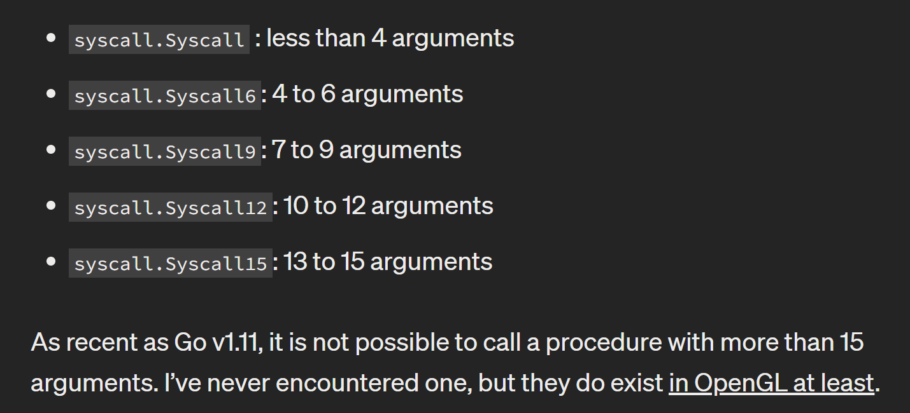
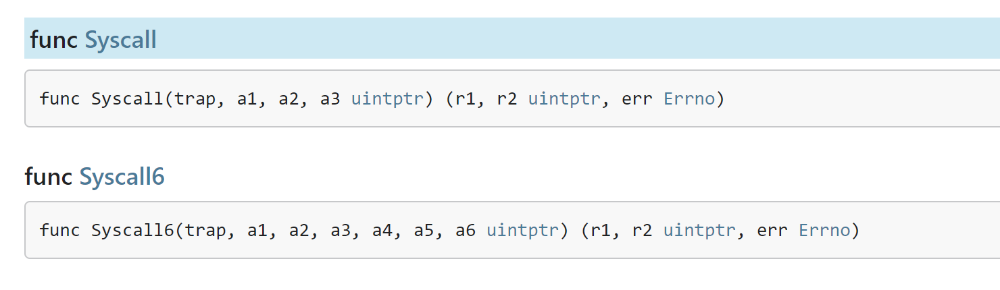
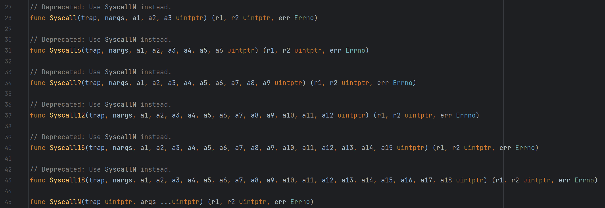
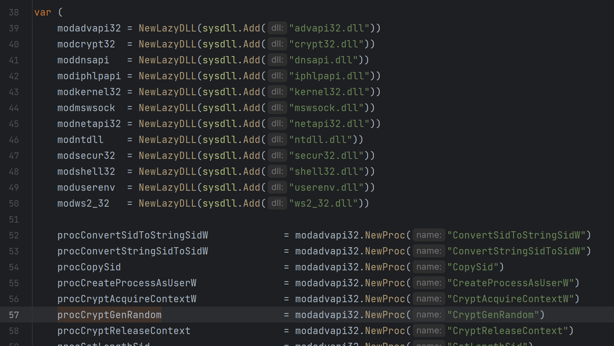
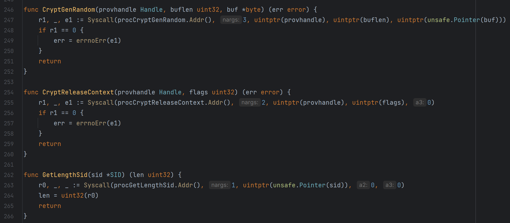
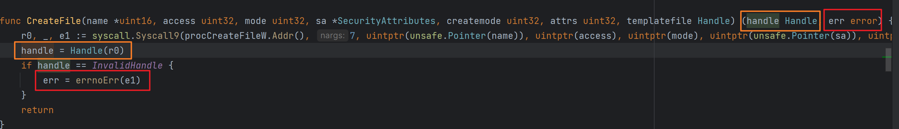

在之前看 Windows API 调用的时候，只记得有很多个 Syscall 的函数版本，用于处理不同个数的参数传递，并没有太注意实际该如何调用

https://justen.codes/breaking-all-the-rules-using-go-to-call-windows-api-2cbfd8c79724



- 在最新版本，有所不同，后面会提到

但是今天在看代码的时候，发现了要去调用的需求，在去查看文档的时候，发现官方没有给出参数说明

https://pkg.go.dev/syscall#Syscall



在源码中翻了一下，发现了 syscall 官方包里面的一些调用例子，大概能猜测出调用方式

在跟入 Syscall 的时候，发现最新版跟上面所描述的有一定的区别

多了 18 参数的调用方案，而且这些都已经被弃用，最终都是选择直接调用 SyscallN 来完成



在翻了几个官方的例子后可以发现第一个参数是实际要调用的函数地址，通过 NewProc，然后调用其 Addr 方法

第二个参数就是后面有多少参数要传递的，紧接着后面就跟着相应个数的参数





按照旧版本有 Syscall、Syscall6 等版本，如果参数不够填满的时候，就用 0 来补充就好了

所以就变成了这个样子

```
Syscall(地址,2,a,a,0)
Syscall6(地址,2,a,a,0,0,0,0)
```

根据返回值可以发现

Syscall 的三个返回值，第一个是函数调用的返回值信息 return，第三个是错误信息，相当于 GetLastError 获取到的内容



