虽然有各种安卓模拟器，但是看着就烦人，一点都不纯净，最终选择使用 Android Studio，用着更安心

# 安装

开始的时候需要下载各种依赖

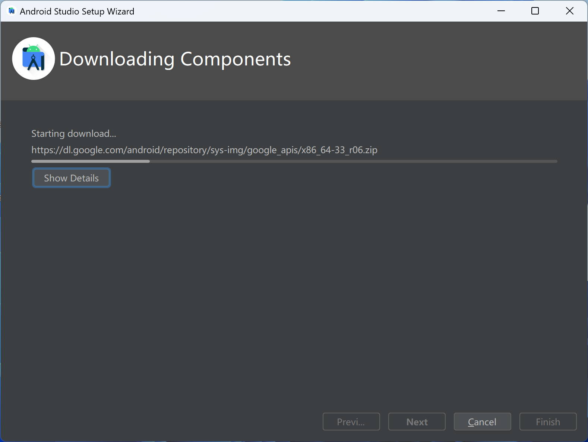

新建项目，选择 No Activity

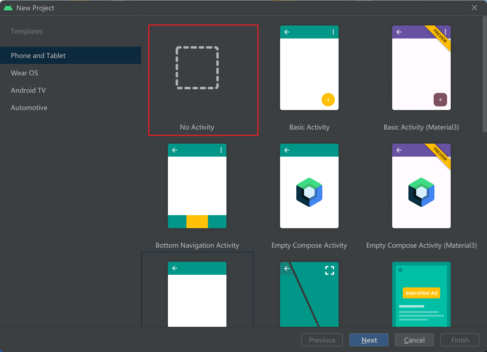

选择详细的版本等信息

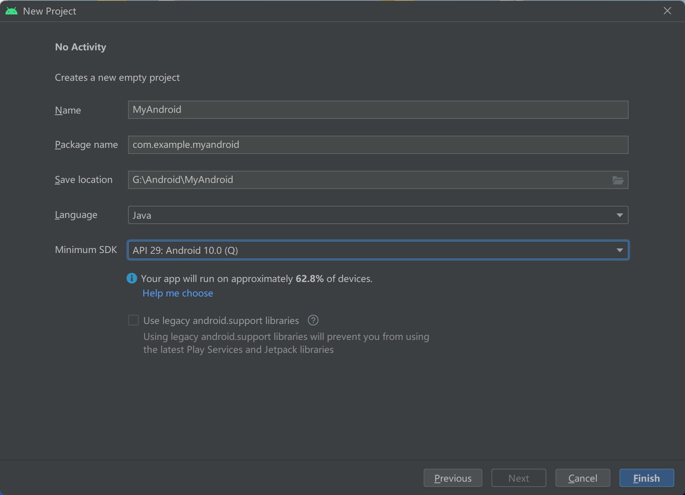

经过短暂等待，下载所需环境之后就进入了项目界面

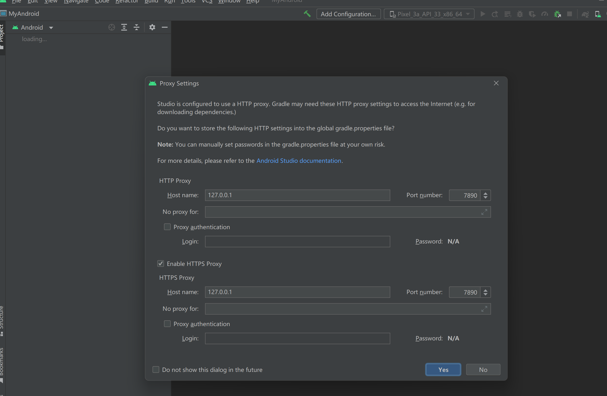

可以在这里新建一个设备

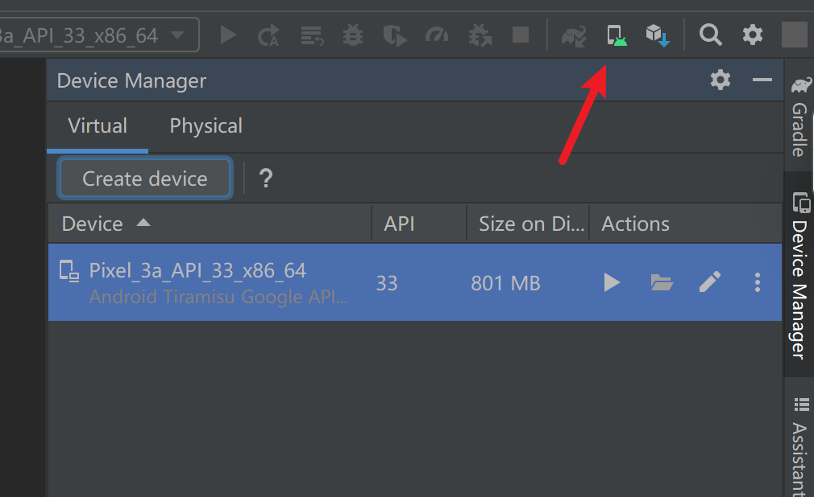

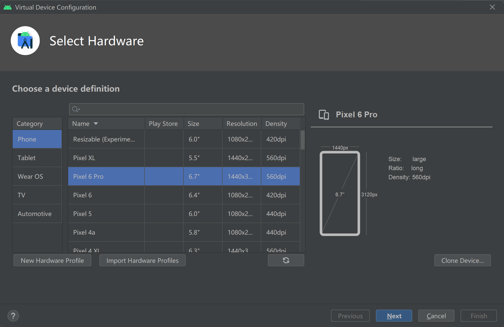

系统镜像选择 S

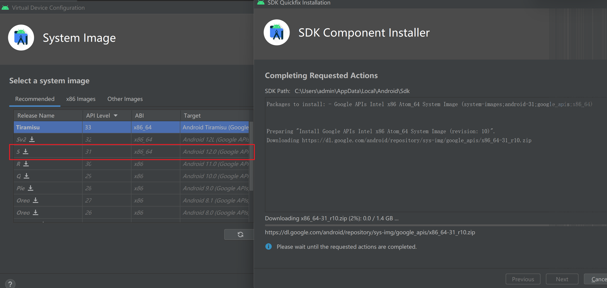

之后就完成了安装

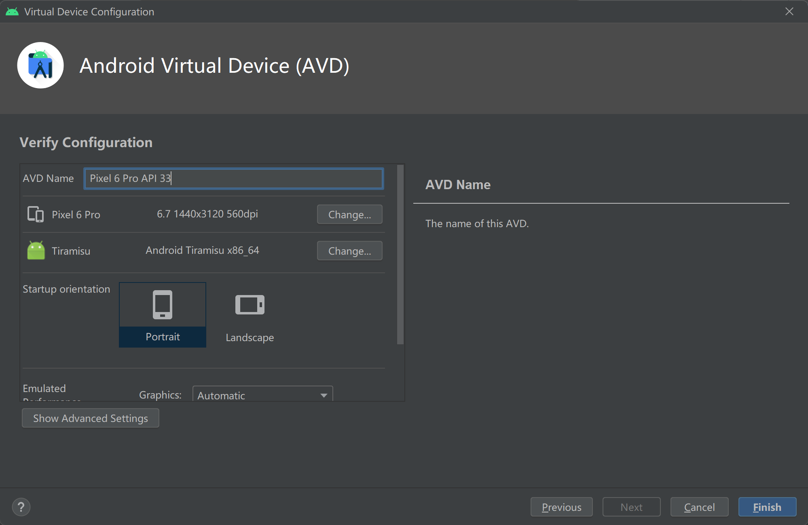

直接运行

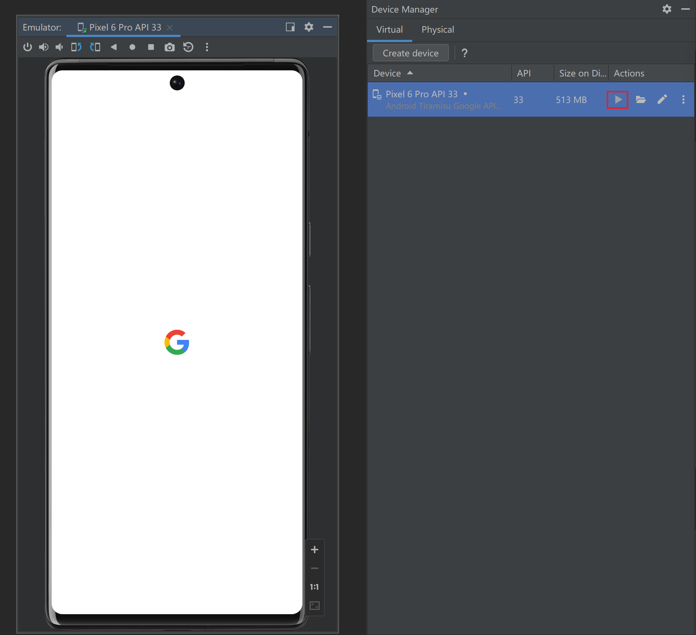

还可以直接管理文件

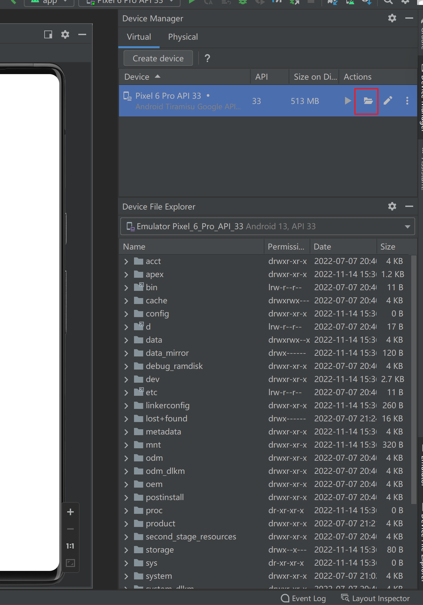

实测画面比较卡顿，经过查找，可以去调整所占用的内存等

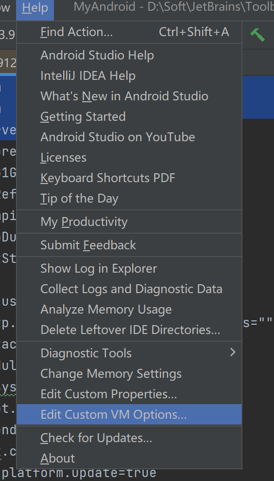

按照自己的情况调整

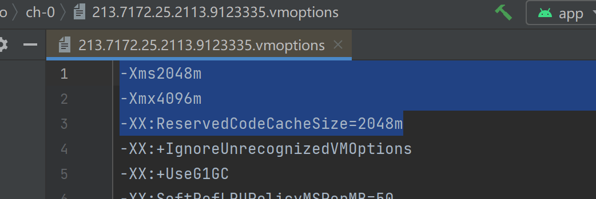

然后清理重启一下

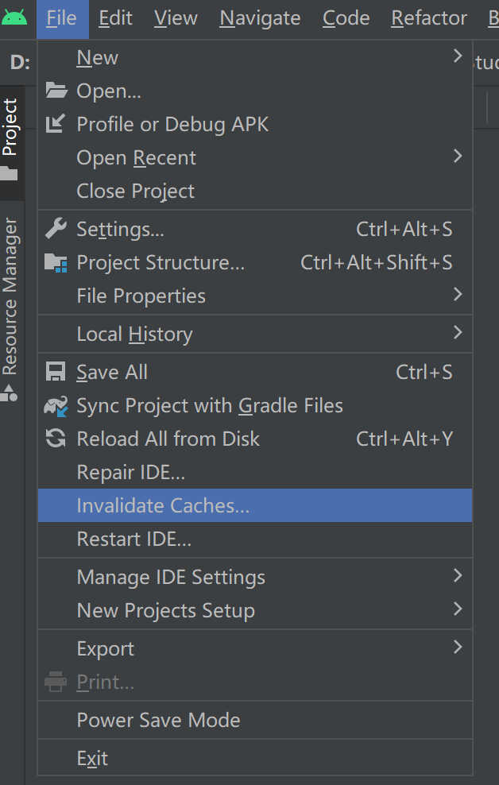

虽然有效果，但还是略卡顿，如果用来替代安卓虚拟机，感觉还是稍微有点不爽

# 参考

https://www.trustedsec.com/blog/set-up-an-android-hacking-lab-for-0/

https://www.jianshu.com/p/d508a4d9c9c4

