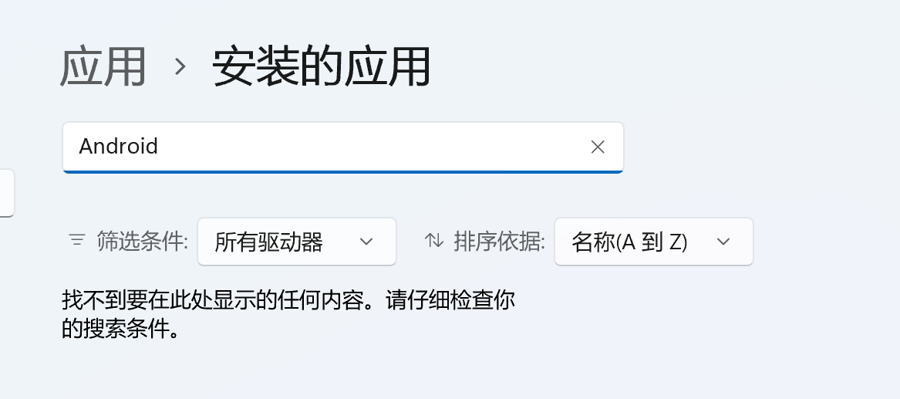
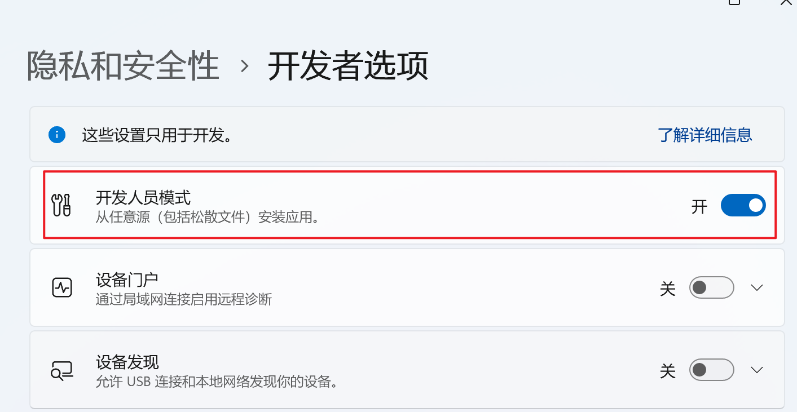
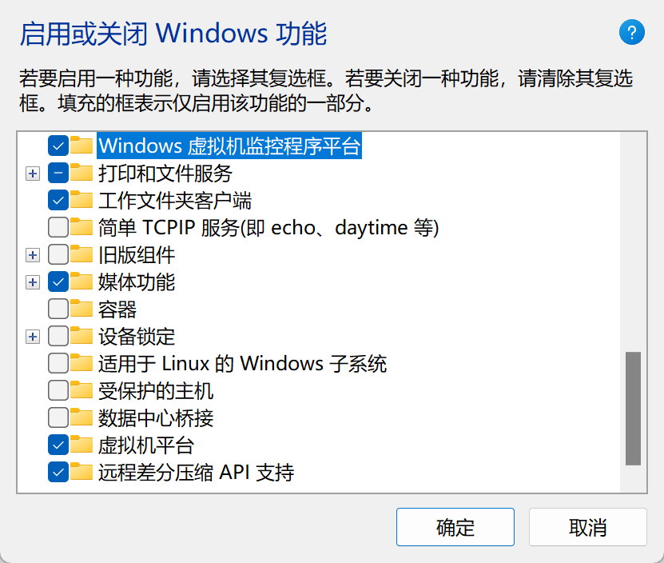
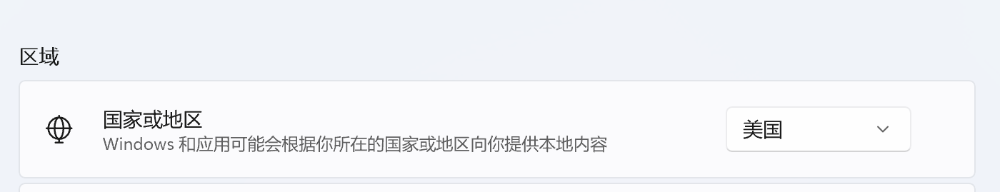
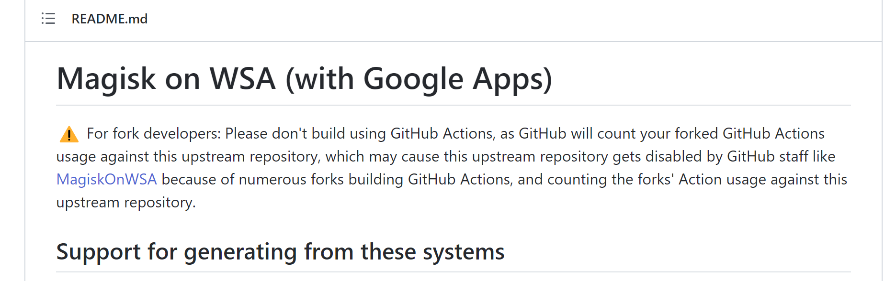
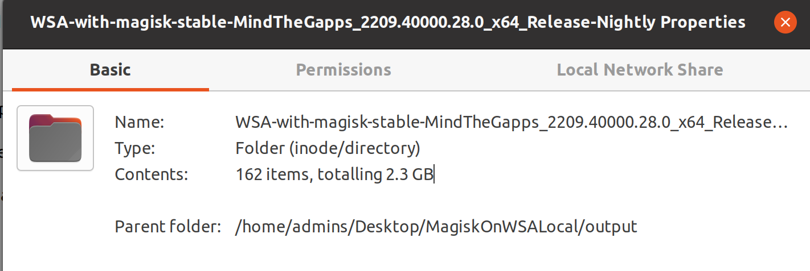
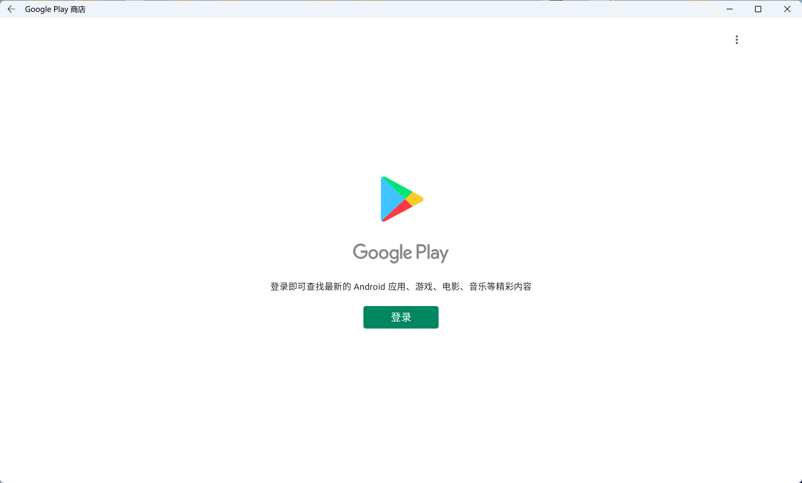
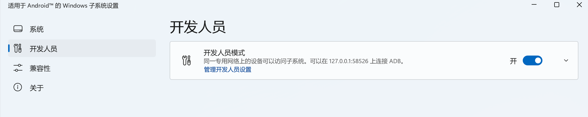
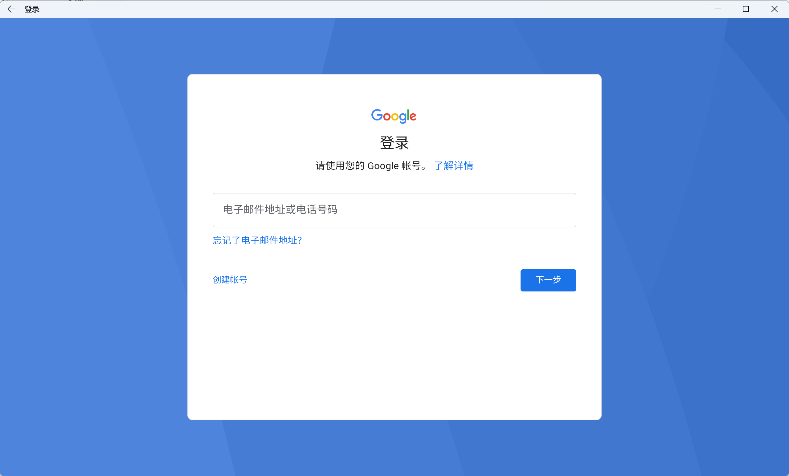

不使用 Windows 默认提供的 WSA，从 https://github.com/LSPosed/MagiskOnWSALocal 中来操作

如果已经安装了，先从已安装中卸载



然后开启开发者模式，允许从其他地方进行安装



启用 虚拟机平台、虚拟机监控程序平台 功能



然后将区域设置为美国，这样才能支持 WSA 和 GoogleStore 的设置



然后到项目中进行下载 https://github.com/LSPosed/MagiskOnWSALocal

因为项目已经不提供 Action 的直接编译了，我们需要在本地进行编译



这里使用的是 Ubuntu，然后使用 root 权限执行 script 目录下的 build.sh

经过漫长的等待....

会在 output 目录下生成一个文件夹，有 2.3G



拷贝出来，放到一个合适的目录下，因为这个文件夹之后是不能被删除的

然后运行目录下的 run.bat，两次继续之后，就可以看到应用商店了



然后在其中开启开发人员模式，方便文件控制等操作




如果安装后不能正常运行，大概率是编译出问题了

可以考虑使用别人已经编译好的 https://github.com/PeterNjeim/MagiskOnWSA


在之后还需要设置代理，不然没办法进行登录

设置代理，第一次执行会出问题，因为需要授权一下 Key，授权之后再执行一次就正常了

```
adb connect 127.0.0.1:58526 && adb shell "settings put global http_proxy `ip route list match 0 table all scope global | cut -F3`:7890"
```

通过下面命令可以查看设置的情况

```
adb shell settings get global http_proxy
```

如果发现 IP:PORT 有问题，还可以通过下面的命令进行修改

```
adb shell settings put global http_proxy 192.168.1.2:7890
```

之后就可以进行登录了




经过使用，在一些情况下，Google Store 会有闪退的情况，但是并不太影响使用
